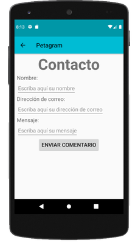

# Descripción

Assignment semana 5 curso Desarrollo de aplicaciones con Android (Coursera).
https://www.coursera.org/learn/desarrollo-de-aplicaciones

# Objetivos

Basándonos en el [assignment de la semana 4](https://github.com/garciacarlos78/javaMail):
  - Generación de persistencia mediante BBDD SQLite.
  - Creación de modelo de BBDD que contenga tabla "mascota" idéntica a POJO Mascota.
  - Funcionalidad fragment últimas 5 rated (la lista "dummy" dejará de serlo y mostrará las últimas 5 mascotas que han recibido un like).
  - Utilización de patrón MVP (Modelo Vista Presentador).
  
# Consideraciones

Aunque se indica que únicamente se guarden en la tabla las últimas 5 mascotas rateadas, se guardan todas.
El motivo es no perder los rates del resto de mascotas. Si hay más de 5 mascotas rateadas, al iniciar de nuevo la app se perderían todos sus "likes".

Se ha aprovechado la característica ROWID para ordenar: cuando una tabla no tiene primary key, SQLite asigna automáticamente una columna de uso interno llamada ROWID por la que se puede ordenar, de forma que las últimas 5 mascotas con "like" serán las de ROWID más alto.

# Capturas de pantalla

## Database

## Main Activity: Lista de mascotas - Mascota propia - Menu

## Last rated - About - Contact

